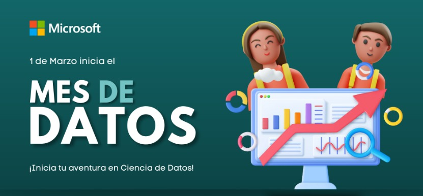

# Mes de datos Microsoft

En este repositorio se encuentra casi el 90% del contenido desarrollado
en el programa de Mes de datos de Microsoft.

## ¿Qué es el Mes de datos de Microsoft?

El Mes de datos de Microsoft es un programa de capacitación gratuito
que se lleva a cabo durante el mes de marzo 2023. El objetivo es
aprender a utilizar las herramientas de Microsoft para el análisis de
datos y la ciencia de datos.

  

# Microsoft Data Month 

